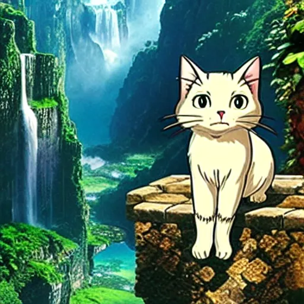

# Multimodal Art Director

A containerized pipeline that acts as a small "art director": it takes a short idea, has an LLM expand it into a detailed image prompt, generates candidate images with Stable Diffusion plus a Studio Ghibli-style LoRA, and keeps the candidate that CLIP scores highest against its prompt (best-of-N). It has a Gradio web UI.

It is an integration project. The models (Qwen, Stable Diffusion, CLIP) are pretrained; what I built is the orchestration, the memory management that makes it fit a 4 GB GPU, the packaging, and the LoRA weights, which I fine-tuned separately (see [Training the LoRA](#training-the-lora)).

<!-- EXAMPLE: add a screenshot of the UI with a generated image, the enhanced prompt and the CLIP score. -->



## How it works

1. **Prompt enhancement (LLM):** a Qwen model, loaded in 4 bit (NF4, double quantization), turns the user's idea into a detailed diffusion prompt. The default in `config.py` is `Qwen/Qwen2.5-0.5B-Instruct`, a small model chosen for testing; a larger one can be set in the same file.
2. **Image generation (diffusion):** Stable Diffusion v1.5 with the Ghibli-style LoRA weights.
3. **Selection (CLIP):** CLIP ViT-B/32 computes the cosine similarity between each image and the prompt it was generated from.
4. **Best-of-N loop:** steps 1 to 3 run `MAX_ITER = 3` times (each time with a newly enhanced prompt), and the highest-scoring image is shown.

The interface is a Gradio app: write an idea, click *Generate*, optionally name the file and save it to `output/`.

## Memory optimization (built for a 4 GB GPU)

The pipeline was developed on a 4 GB GPU under WSL2. To avoid CUDA out-of-memory errors:

- **LLM quantization:** 4-bit NF4 with double quantization (`bitsandbytes`).
- **CPU offloading:** `enable_model_cpu_offload()` keeps the Stable Diffusion sub-models (text encoder, U-Net, VAE) in RAM and moves each to the GPU only while it computes.
- **CLIP on the CPU:** the evaluator is never moved to the GPU.
- **Manual cleanup:** `gc.collect()` and `torch.cuda.empty_cache()` after every iteration.

With more resources, change the global variables in `config.py`.

## Training the LoRA

The style weights were trained **once, separately from the app**, in `training/LoRa_Ghibli_style.ipynb` (designed for Google Colab).

- **Data:** the public Hugging Face dataset `moving-j/ghibli-style-100` (100 image/caption pairs, resized to 512×512). The data are not mine. Check the dataset's page for its terms.
- **Method:** LoRA fine-tuning of Stable Diffusion v1.5 with the `train_text_to_image_lora.py` example script from Hugging Face `diffusers` (© Hugging Face, Apache-2.0), kept in `lora/`. I did not write that script. The settings are in `lora/lora_accelerate_script.sh`: 512 px, batch size 1, 100 epochs, learning rate 1e-4.
- **Cost:** about 3.5 hours on a Colab GPU.
- **Result:** the weights are public at [`RicB03/sd1.5-ghibli-style-lora`](https://huggingface.co/RicB03/sd1.5-ghibli-style-lora) on Hugging Face. The app downloads them at startup with `hf_hub_download`.
- **Reproducibility:** this was a one-off run to obtain the weights, not a polished pipeline, and the notebook is not guaranteed to run again end to end. A `RUN_TRAINING` flag switches between training and just downloading the published weights. The last cells compare the base model and the LoRA on the same prompt with a fixed seed.

To use another style, change `REPO_ID` and `SAFETENSORS_FILENAME` in `config.py` to point to other LoRA weights.

## How to run

Requirements: Docker, an NVIDIA GPU and the [NVIDIA Container Toolkit](https://docs.nvidia.com/datacenter/cloud-native/container-toolkit/latest/install-guide.html) (the 4-bit LLM needs the GPU).

```bash
git clone https://github.com/Ric03aipy/Art-Director-Ghibli-style-generation.git
cd Art-Director-Ghibli-style-generation
docker build -t art_director .
docker run -p 7860:7860 --gpus all \
  -v ~/.cache/huggingface:/root/.cache/huggingface \
  -v $(pwd)/models:/app/models \
  -v $(pwd)/output:/app/generated_images \
  art_director
```

The first run downloads the models and the LoRA weights, so it takes a while. Then open http://127.0.0.1:7860.

## Repository structure

```
main.py               Gradio app and best-of-N loop
prompt_optimizer.py   quantized LLM that enhances the prompt
diff_generator.py     Stable Diffusion + LoRA (downloads the weights)
evaluator.py          CLIP scoring
config.py             model names, paths, MAX_ITER, prompts
lora/                 Hugging Face training script and accelerate launch script
training/             Colab notebook used to train the LoRA
models/, output/      LoRA weights (downloaded) and saved images
Dockerfile, requirements.txt
```

## Limitations

- **No quantitative evaluation** of the style transfer: judging the results is subjective, and I have only compared images by eye. The CLIP score is a selection heuristic, not a quality metric; also, since each candidate has its own enhanced prompt, the scores of different candidates are not strictly comparable.
- **Small models:** the default LLM has 0.5 B parameters, so the quality of the enhanced prompts is limited. The LoRA was trained on only 100 images.
- **Needs an NVIDIA GPU** (4-bit quantization); not tested on other hardware.
- **No automated tests.**
- Not affiliated with Studio Ghibli: "Ghibli style" only describes the look the LoRA imitates.
